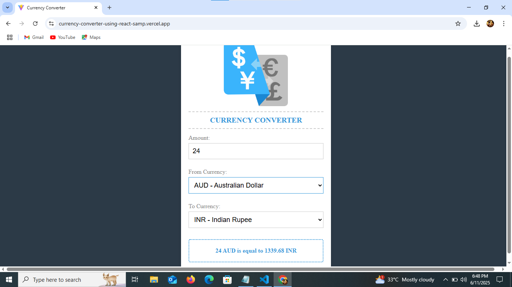

# React Currency Converter

A simple and responsive currency converter built using React and the ExchangeRate-API. Converts an amount from one currency to another in real-time.

## Demo

🔗 **Live Link**: [Click here to view the demo](https://currency-converter-using-react-samp.vercel.app/)


## Developed By
**Gayathri G**  
GitHub: [GAYATHRI1006](https://github.com/GAYATHRI1006)

## Screenshot





## Features

- Real-time currency exchange using ExchangeRate-API  
- Convert between popular currencies  
- Simple and clean UI  
- Automatically updates conversion on value or currency change
  
## Getting Started

### 1. Clone the Repository

```bash
git clone https://github.com/GAYATHRI1006/Currency_Converter_using_React.git
```

### 2. Install Dependencies

```bash
npm install
```

### 3. Run the App

```bash
npm run dev
```


## Tech Stack

- **React**  
- **JavaScript**  
- **Axios**  
- **HTML5**  
- **CSS3**  

## API Used

- [ExchangeRate API](https://www.exchangerate-api.com/)  
You can replace this API with any free currency API if needed.


